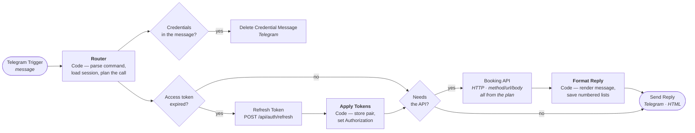
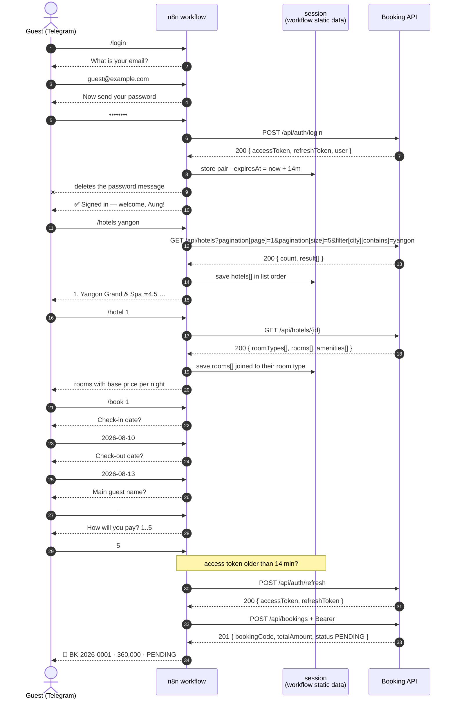
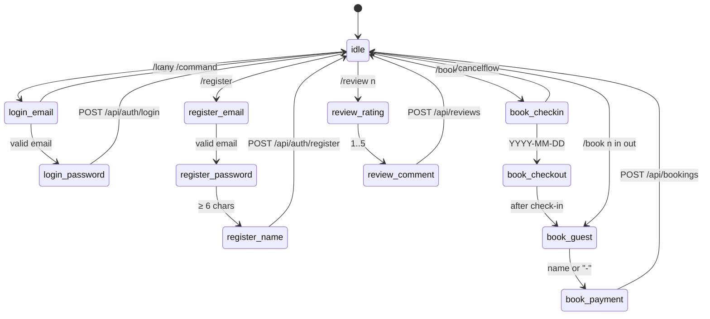

# n8n Telegram Bot — Hotel Listing & Booking

An n8n workflow that puts the guest journey from [user-journey.md](./user-journey.md) behind a
Telegram chat: register / login, browse hotels, open a hotel's rooms, book a stay, watch the
booking, cancel it, review it. It talks to the same REST API described in
[architecture.md](./architecture.md) — no database access, no shortcuts around the auth guards.

| File | Role |
| ---- | ---- |
| [`n8n/hotel-booking-telegram-bot.json`](../n8n/hotel-booking-telegram-bot.json) | the importable workflow — **generated, do not hand-edit** |
| [`n8n/nodes/router.js`](../n8n/nodes/router.js) | command parsing, conversation state machine, API call planning |
| [`n8n/nodes/apply-tokens.js`](../n8n/nodes/apply-tokens.js) | applies a refreshed token pair to the pending request |
| [`n8n/nodes/format-reply.js`](../n8n/nodes/format-reply.js) | API response → Telegram message, and session updates |
| [`n8n/build.mjs`](../n8n/build.mjs) | assembles the three sources into the workflow JSON |
| [`n8n/deploy.mjs`](../n8n/deploy.mjs) | pushes that JSON into a running n8n over its REST API |
| [`n8n/build-sdk.mjs`](../n8n/build-sdk.mjs) | emits the same graph as n8n Workflow SDK code, for the n8n MCP server |
| [`n8n/set-telegram-commands.mjs`](../n8n/set-telegram-commands.mjs) | registers the `/` command menu, menu button and bot descriptions with Telegram |
| [`n8n/hotel-booking-telegram-bot.sdk.js`](../n8n/hotel-booking-telegram-bot.sdk.js) | generated SDK code — **do not hand-edit** |

Edit a source, then `node n8n/build.mjs && node n8n/deploy.mjs`. Keeping the JavaScript outside
the JSON is what makes it reviewable in a diff.

Both generators read the same `nodes/*.js`, so the JSON and the SDK code can never drift:

| Path into n8n | Build | Push |
| ------------- | ----- | ---- |
| REST API | `node n8n/build.mjs` | `node n8n/deploy.mjs` |
| MCP server | `node n8n/build-sdk.mjs` | `validate_workflow` → `create_workflow_from_code` / `update_workflow` |
| Manual | `node n8n/build.mjs` | Workflows → Import from File |

---

## 1. Workflow shape



One HTTP node serves every endpoint: the Router emits
`api = { method, url, headers, body }` and the node reads them from expressions. Adding a
command means editing `router.js` and `format-reply.js` — never the canvas.

`Booking API` runs with `neverError` + `fullResponse`, so a `401`/`403`/`422` arrives as normal
data and `Format Reply` turns the API's error envelope into a sentence, instead of the run
going red with nothing sent back to the user.

---

## 2. A booking conversation, end to end



---

## 3. Conversation state machine

The Router keeps one `stage` per chat. A slash command always aborts the current flow, so a
user can never get stuck.



Dates are validated in the Router — format, check-out after check-in, no past check-in — so an
obvious mistake costs a message instead of a `400` round trip.

---

## 4. Commands

| Command | API call | Auth |
| ------- | -------- | ---- |
| `/start`, `/help` | — | — |
| `/register` | `POST /api/auth/register` | — |
| `/register <email> <pw> <first> <last>` | same, one shot | — |
| `/login` | `POST /api/auth/login` | — |
| `/login <email> <pw>` | same, one shot | — |
| `/logout` | — (drops the tokens from the session) | — |
| `/me` | `GET /api/auth/me` | Bearer |
| `/hotels` | `GET /api/hotels` | — |
| `/hotels <city>` | `+ filter[city][contains]` | — |
| `/hotels <city> <page>` | `+ pagination[page]` | — |
| `/hotel <n>` | `GET /api/hotels/:id` | — |
| `/book <n>` | guided → `POST /api/bookings` | Bearer |
| `/book <n> <in> <out>` | guest + payment only → `POST /api/bookings` | Bearer |
| `/mybookings` | `GET /api/bookings` | Bearer |
| `/cancel <n>` | `DELETE /api/bookings/:id` | Bearer |
| `/review <n>` | guided → `POST /api/reviews` | Bearer |
| `/review <n> <1-5> [comment]` | same, one shot | Bearer |
| `/pay` | — (explains that only staff settle payments) | — |
| `/cancelflow` | — (abandons the current wizard) | — |

`<n>` always indexes **the last list the bot showed you** — hotels for `/hotel`, rooms for
`/book`, bookings for `/cancel` and `/review`. The API's ids are UUIDs; nobody should type those.

`/pay` exists because the journey has a hole a guest will walk into: a booking is created with a
`PENDING` payment, but `PATCH /api/payments/:id/status` is restricted to `ADMIN` / `HOTEL_STAFF`
([user-journey.md §3.4](./user-journey.md#34-pay)). The bot says so rather than failing with a
`403`.

---

## 5. Sessions

State lives in the workflow's **static data**, keyed by Telegram chat id:

```js
sessions['123456789'] = {
  stage, draft,                            // wizard position and partial input
  accessToken, refreshToken, expiresAt,    // credentials
  user,                                    // for the "-" guest-name shortcut
  hotels[], rooms[], bookings[],           // the numbered lists
}
```

Three things to know:

1. **Static data is only persisted on production executions.** Run the workflow manually from
   the editor and the session is thrown away when the run ends. The bot only remembers logins
   once the workflow is **Active**.
2. **Tokens sit in the n8n database in clear text.** That is the same exposure as any n8n
   credential, but it is guest access tokens, so treat the n8n instance as sensitive.
3. **`expiresAt` is set a minute short of the API's 15-minute TTL.** When it lapses the Router
   raises `tokenRefreshNeeded`, the refresh runs, and the original request continues — the user
   never sees it. If the 7-day refresh token is also dead, the session is wiped and the bot asks
   for `/login`.

---

## 6. Setup

### 6.1 Create the bot

1. Talk to [@BotFather](https://t.me/BotFather) → `/newbot` → copy the token.
2. Register the command menu — the list Telegram shows when a user types `/` or taps the
   **Menu** button. Either run

   ```bash
   node n8n/set-telegram-commands.mjs <BOT_TOKEN>     # --show to inspect without changing
   ```

   which also sets the menu button to `commands` and fills in the bot's descriptions, or paste
   the same list into BotFather under `/setcommands`:

   ```
   start - Show the menu
   hotels - Browse hotels — /hotels yangon to filter by city
   hotel - Open hotel #n from the last list, with its rooms
   book - Book room #n — I ask for dates step by step
   mybookings - My bookings and their status
   cancel - Cancel booking #n
   review - Review booking #n after checkout
   login - Sign in
   register - Create a guest account
   me - Who am I
   logout - Forget my tokens
   pay - How payment works
   cancelflow - Abandon the current step-by-step flow
   help - Show the menu
   ```

   The menu is cosmetic — Telegram does not restrict input to it, and the Router accepts every
   command whether or not it is registered. Keep the list in
   [`set-telegram-commands.mjs`](../n8n/set-telegram-commands.mjs) in step with `router.js`.

### 6.2 Make the webhook reachable

**Read this before deploying — it is the one thing that will stop the bot working.**

n8n's Telegram Trigger is webhook-only. Activating the workflow calls Telegram's `setWebhook`
with n8n's own URL; there is no polling mode to fall back to. Telegram then requires that URL
to use a **publicly trusted certificate** on port 443/80/88/8443.

Caddy serves n8n at `https://n8n.test` with `tls internal`, i.e. a private CA. Telegram cannot
verify it, so that hostname works for the editor and never for the bot. Pick one:

| | How | Good for |
| - | --- | -------- |
| **Built-in tunnel** | `command: start --tunnel` — already set in [`docker-compose.n8n.yml`](../docker-compose.n8n.yml) | dev; the URL changes on every restart |
| **Real hostname** | Cloudflare Tunnel / ngrok / public DNS + `WEBHOOK_URL: https://host/` | anything long-lived |

The environment variable is `WEBHOOK_URL`, **not** `N8N_WEBHOOK_URL` — n8n ignores the latter
and falls back to building the URL from `N8N_PROTOCOL`/`N8N_HOST`/`N8N_PORT`, which yields a
port-suffixed URL Telegram will reject. With `--tunnel`, n8n fills `WEBHOOK_URL` in itself.

Nothing else in the workflow depends on the hostname.

### 6.3 Deploy

Create an API key in n8n → **Settings → n8n API**, then:

```powershell
setx N8N_API_KEY "<key>"      # once; reopen the terminal afterwards
node n8n/build.mjs
node n8n/deploy.mjs
```

`deploy.mjs` creates the workflow the first time and updates it by name after that, so
re-running never leaves a duplicate. It targets `http://127.0.0.1:5678` — the container port
directly, bypassing Caddy — unless you pass `--url`.

Credentials are not part of the workflow JSON, so attach them in the UI once:

1. Open **Telegram Trigger** → create a **Telegram API** credential with the BotFather token.
2. Assign that same credential to **Send Reply** and **Delete Credential Message**.

Then activate, which is when n8n registers the webhook with Telegram:

```powershell
node n8n/deploy.mjs --activate
```

### 6.4 Point it at the API

`API_BASE_URL` is the first constant in [`n8n/nodes/router.js`](../n8n/nodes/router.js) — it is
the single place the base URL appears, including the refresh call.

| Where n8n runs | Value |
| -------------- | ----- |
| Docker, API on the Windows host (default) | `http://host.docker.internal:4000` |
| Docker, joined to `booking-network` | `http://booking-dev:4000` |
| Same host, no Docker | `http://localhost:4000` |

To join the app's network instead, add to `docker-compose.n8n.yml`:

```yaml
services:
  n8n:
    networks: [booking-network]
networks:
  booking-network:
    external: true
```

After changing the constant: `node n8n/build.mjs && node n8n/deploy.mjs --activate`.

### 6.5 Lock it down

`ALLOWED_CHAT_IDS` in `router.js` is empty, so anyone who finds the bot can use it. Send
`/start`, read the chat id from the execution log, and put it in the array:

```js
const ALLOWED_CHAT_IDS = ['123456789'];
```

---

## 7. Design notes

**Passwords in chat history.** `/login` and `/register` collect credentials, and Telegram keeps
every message. The workflow deletes the message that contained the password immediately —
that is the `Credentials in the message?` branch. Deletion fails silently in groups where the
bot is not an admin, and on messages older than 48 hours; the node is set to continue on error
so the reply still goes out. **Use the bot in a direct chat, not a group.**

**Why `PAGE_SIZE = 5`.** `paginationSchema` defaults `size` to `'100'` while validating
`size < 100`, so a list request without an explicit `pagination[size]` returns `422`
([user-journey.md §3.1](./user-journey.md#31-discover-anonymous)). Every list call therefore
sends the parameter. Five fits a phone screen; anything under 100 is valid.

**Why rooms come from the hotel detail call.** `GET /api/rooms` has no `hotelId` filter, but
`GET /api/hotels/:id` includes `roomTypes` and `rooms`, so one request gives the room list and
the prices. The bot joins them on `roomTypeId` client-side.

**Prices are indicative.** The hotel detail response carries `RoomType.basePrice`, not the
seasonal `RoomRate`. The booking service picks the applicable rate at write time and may charge
less, so the room list says "from". The message after `POST /api/bookings` shows the real total.

**Availability is not pre-checked.** The API has no date-range availability endpoint, so
`/book` finds out by trying. `Room is already booked for the selected dates` comes back as a
plain `⚠️` message and the user can retry with other dates.

**Room status is shown, not enforced.** `MAINTENANCE` and `CLEANING` rooms are listed with their
status attached, because `BookingService.create` only checks date overlap — it never reads
`Room.status`. The bot reflects the API's actual behaviour rather than inventing a rule.

**One update per execution.** `Format Reply` reads the plan with `$('Router').first()`, which is
safe because the Telegram Trigger fires once per update. If you ever add a batching source, that
assumption breaks.

---

## 8. Not covered

The bot is the **guest** journey only. Staff and admin actions — confirming a booking, marking a
payment `COMPLETED`, checking guests in and out, managing inventory — are separate flows against
`PATCH /api/bookings/:id/status`, `PATCH /api/payments/:id/status` and the hotel/room endpoints.
They belong in their own workflow with its own chat allowlist, since a `HOTEL_STAFF` token in a
group chat would hand booking control to everyone in it.

Before running this against anything real, read
[user-journey.md §10](./user-journey.md#10-gaps-between-intent-and-code) — in particular that
any authenticated user can currently read and delete **any** user through `/api/users`.
