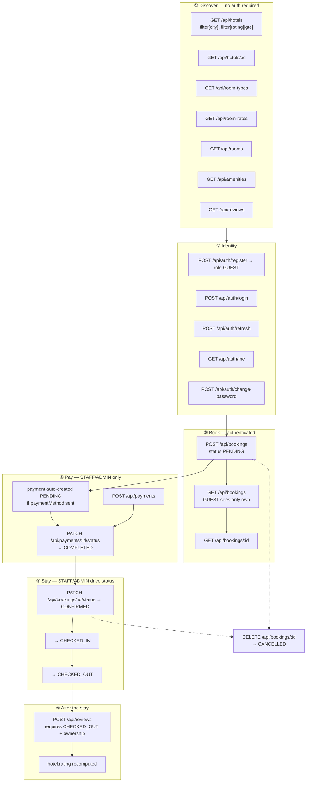
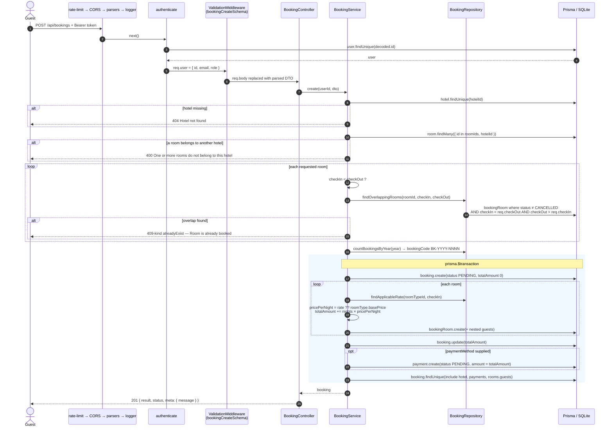
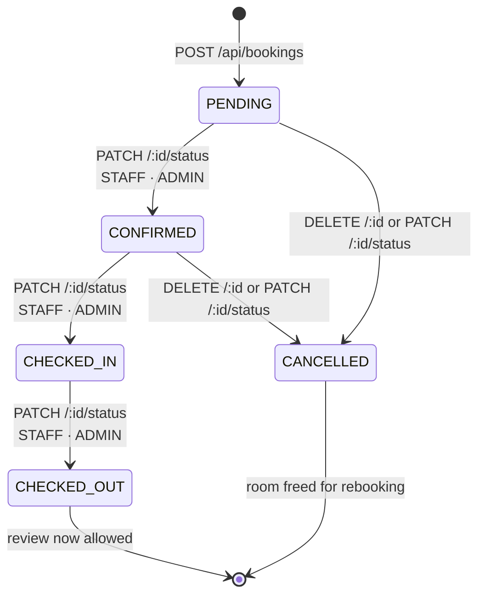
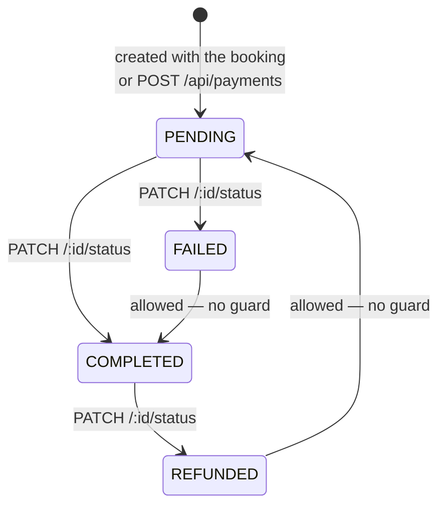
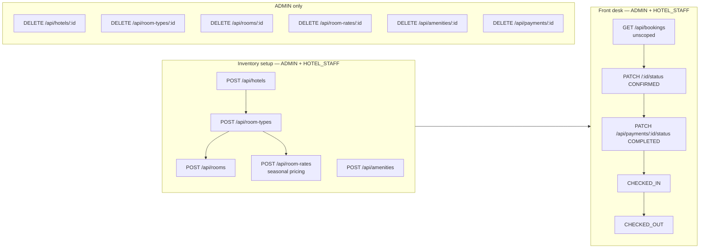

# Hotel Booking API — User Journey

> Behavioural reference, extracted from the code (`src/app/`, `src/modules/`, `src/middlewares/`).
> Every endpoint, guard, rule and status transition below was read off the implementation, not
> from a design intent. Where the code disagrees with [architecture.md](./architecture.md),
> the code is documented and the gap is called out in [§10](#10-gaps-between-intent-and-code).

---

## 1. Actors

| Actor | `role` | How they are recognised |
| ----- | ------ | ----------------------- |
| **Anonymous visitor** | — | no `Authorization` header; reaches only routes with no `authenticate` |
| **Guest** | `GUEST` | default role assigned at `POST /api/auth/register` ([auth.service.ts:69](../src/modules/auth/auth.service.ts#L69)) |
| **Hotel staff** | `HOTEL_STAFF` | assigned out-of-band (no endpoint promotes a user) |
| **Admin** | `ADMIN` | assigned out-of-band |

`authenticate` verifies the RS256 access token, then **re-loads the user from the database** —
a deleted user's still-valid token is rejected with `401 User no longer exists`
([auth.middleware.ts:42-57](../src/middlewares/auth.middleware.ts#L42-L57)).

---

## 2. Journey map (all actors)



Solid arrows are the happy path. Dotted arrows are the only two states a booking may be
cancelled from.

---

## 3. Stage-by-stage

### 3.1 Discover (anonymous)

| Endpoint | Guard | Notes |
| -------- | ----- | ----- |
| `GET /api/hotels` | none | only list endpoint with real filtering — `hotelFilterQuerySchema` via `validateRequestQuery` |
| `GET /api/hotels/:id` | none | |
| `GET /api/room-types`, `/:id` | none | pagination only, **no `hotelId` filter** |
| `GET /api/room-rates`, `/:id` | none | pagination only |
| `GET /api/rooms`, `/:id` | none | pagination only, **no availability/date search** |
| `GET /api/amenities`, `/:id` | none | |
| `GET /api/reviews`, `/:id` | none | see the scoping quirk in §10.3 |
| `GET /health-check` | none | returns the configured `PORT` |

There is no "search available rooms for these dates" endpoint. A client must list rooms,
attempt `POST /api/bookings`, and treat `409-style` `alreadyExist` as "not available".

**Pagination is mandatory in practice** — `paginationSchema` defaults `size` to `'100'` while
requiring `size < 100`, so any list request without `pagination[size]` fails validation
([schema.ts:174-178](../src/app/core/schema.ts#L174-L178)). Always send
`?pagination[page]=1&pagination[size]=20`.

### 3.2 Identity

| Endpoint | Guard | Result |
| -------- | ----- | ------ |
| `POST /api/auth/register` | body zod | `201` + `{ accessToken, refreshToken, user }`; email lowercased; duplicate → `alreadyExist` |
| `POST /api/auth/login` | body zod | `{ accessToken, refreshToken, user }`; wrong email *or* password → the same `invalidCredential` message |
| `POST /api/auth/refresh` | body zod | new **pair** of tokens; verified against `REFRESH_TOKEN_PUBLIC_KEY` |
| `GET /api/auth/me` | `authenticate` | profile without `passwordHash` |
| `POST /api/auth/change-password` | `authenticate` + body zod | message only; **existing tokens are not revoked** |

Access token 15 m, refresh token 7 d ([auth.service.ts:16-17](../src/modules/auth/auth.service.ts#L16-L17)).
There is no logout, no token blacklist, and no refresh-token rotation store — a refresh token
stays valid for its full 7 days.

### 3.3 Book

```
POST /api/bookings
{
  "hotelId": "…",
  "rooms": [{
    "roomId": "…",
    "checkInDate": "2026-08-10",
    "checkOutDate": "2026-08-13",
    "guests": [{ "fullName": "…", "email": "…", "isPrimary": true, "idProofNumber": "…" }]
  }],
  "paymentMethod": "CREDIT_CARD"     // optional
}
```

`rooms` must hold at least one entry; `guests` is optional per room
([booking.schema.ts](../src/modules/booking/booking.schema.ts)).

| Endpoint | Guard | Visibility |
| -------- | ----- | ---------- |
| `GET /api/bookings` | `authenticate` | `GUEST` → `where.userId = self`; STAFF/ADMIN → every booking |
| `GET /api/bookings/:id` | `authenticate` | `GUEST` on someone else's booking → `403 Access denied` |
| `POST /api/bookings` | `authenticate` + body zod | any role, always `status: PENDING` |
| `PATCH /api/bookings/:id/status` | `authenticate` + `authorize('ADMIN','HOTEL_STAFF')` | state machine, §5 |
| `DELETE /api/bookings/:id` | `authenticate` | ownership checked via `getById`, then forced to `CANCELLED` |

### 3.4 Pay

A guest **cannot record their own payment.** `POST /api/payments` and
`PATCH /api/payments/:id/status` both require `ADMIN` or `HOTEL_STAFF`
([payment.controller.ts:65-96](../src/modules/payment/payment.controller.ts#L65-L96)).

The guest's only influence is `paymentMethod` on the booking body, which makes the booking
transaction insert one `Payment` row with `amount = totalAmount` and `status: PENDING`
([booking.service.ts:179-188](../src/modules/booking/booking.service.ts#L179-L188)).
Staff later flip it to `COMPLETED` and attach `transactionRef` / `paidAt`.

Reading is scoped: a `GUEST` listing payments gets `where.booking.userId = self`
([payment.service.ts:23-27](../src/modules/payment/payment.service.ts#L23-L27)).

### 3.5 Stay

Only staff/admin move a booking through `CONFIRMED → CHECKED_IN → CHECKED_OUT`. Nothing in
the code ties confirmation to a completed payment — `PATCH /:id/status` never inspects
`Payment.status`. That policy, if wanted, is unimplemented.

### 3.6 Review

`POST /api/reviews` enforces four rules in order
([review.service.ts:66-107](../src/modules/review/review.service.ts#L66-L107)):

1. booking exists → else `404`
2. `booking.userId === req.user.id` → else `403 You can only review your own bookings`
3. `booking.status === 'CHECKED_OUT'` → else `400`
4. no review yet for that `bookingId` → else `alreadyExist`

`hotelId` is copied from the booking, never taken from the request. After every
create / update / delete the hotel's `rating` is recomputed as the average of its reviews,
rounded to one decimal.

Editing is owner-only. Deleting is owner **or** `ADMIN`.

---

## 4. Booking creation — request lifecycle



Pricing details worth knowing:

- `nightsBetween` is `max(1, round(Δms / 86 400 000))` — a same-day booking still bills one
  night, and DST shifts round to the nearest day ([booking.service.ts:12-13](../src/modules/booking/booking.service.ts#L12-L13)).
- `findApplicableRate` matches any `RoomRate` whose range covers **check-in only**, ordered
  `pricePerNight: 'asc'` → when several rates overlap, the **cheapest wins**, and a rate change
  mid-stay is ignored ([booking.repository.ts:35-44](../src/modules/booking/booking.repository.ts#L35-L44)).
- `pricePerNight` is snapshotted onto `BookingRoom`, so later rate edits never re-price a
  booking.

---

## 5. Booking status lifecycle



The guard is a reverse map — `TRANSITIONS[target]` lists the states allowed to enter it
([booking.service.ts:15-21](../src/modules/booking/booking.service.ts#L15-L21)):

| Target | Allowed from |
| ------ | ------------ |
| `CONFIRMED` | `PENDING` |
| `CHECKED_IN` | `CONFIRMED` |
| `CHECKED_OUT` | `CHECKED_IN` |
| `CANCELLED` | `PENDING`, `CONFIRMED` |
| `PENDING` | *(nothing — a booking can never return to PENDING)* |

Anything else → `400 Invalid status transition from X to Y`.

A `CANCELLED` booking's rooms become bookable again immediately, because the overlap query
excludes non-`CANCELLED` bookings only.

---

## 6. Payment status lifecycle



The dashed reality: `PaymentService.updateStatus` applies whatever status the body carries with
**no transition validation at all** ([payment.service.ts:76-96](../src/modules/payment/payment.service.ts#L76-L96)).
The diagram's lower two edges exist only because nothing forbids them. Unlike bookings,
payments have no state machine.

`DELETE /api/payments/:id` is `ADMIN`-only and hard-deletes the row.

---

## 7. Staff & admin journeys



### Effective permission matrix

| Action | Anonymous | GUEST | HOTEL_STAFF | ADMIN |
| ------ | :-------: | :---: | :---------: | :---: |
| Browse hotels / room-types / rooms / rates / amenities | ✅ | ✅ | ✅ | ✅ |
| Read reviews | ✅ | own only | own only | ✅ |
| Register / login / refresh | ✅ | ✅ | ✅ | ✅ |
| Create booking | ❌ | ✅ | ✅ | ✅ |
| List / read bookings | ❌ | own only | all | all |
| Cancel booking | ❌ | own only | any | any |
| Booking status transitions | ❌ | ❌ | ✅ | ✅ |
| Create payment / set payment status | ❌ | ❌ | ✅ | ✅ |
| Delete payment | ❌ | ❌ | ❌ | ✅ |
| Create / update hotel · room-type · room · rate · amenity | ❌ | ❌ | ✅ | ✅ |
| Delete hotel · room-type · room · rate · amenity | ❌ | ❌ | ❌ | ✅ |
| Write a review | ❌ | own checked-out booking | same | same |
| Delete any review | ❌ | own only | own only | ✅ |
| **List / read / update / delete *any* user** | ❌ | ⚠️ ✅ | ⚠️ ✅ | ✅ |

The last row is not a typo — see §10.1.

---

## 8. Data written at each stage

| Stage | Rows created / changed |
| ----- | ---------------------- |
| Register | `User` (`role: GUEST`, bcrypt cost 10) |
| Create booking | `Booking` + `BookingRoom[]` + `BookingGuest[]` (+ `Payment` if `paymentMethod`) — one transaction |
| Confirm / check-in / check-out | `Booking.status` |
| Cancel | `Booking.status = CANCELLED` — rows are kept, nothing is deleted |
| Record payment | `Payment.status`, `transactionRef`, `paidAt` |
| Review | `Review` + `Hotel.rating` recomputed |

---

## 9. Error paths a client must handle

| Situation | `errorKinds` | HTTP |
| --------- | ------------ | :--: |
| Body/query fails zod | `validationFailed` / raw `ZodError` | 422 |
| Missing `Authorization` header | `notAuthorized` | 401 |
| Token valid but user row deleted | `notAuthorized` | 401 |
| **Expired or malformed access token** | `invalidToken` | **403** |
| Wrong email or password | `invalidCredential` | 422 |
| Role not in `authorize(...)` | `forbidden` | 403 |
| Guest reads another guest's booking / payment / review | `forbidden` | 403 |
| Hotel / booking / payment / review id unknown | `notFound` | 404 |
| Room belongs to another hotel · `checkIn >= checkOut` · illegal status transition · review on a non-`CHECKED_OUT` booking | `badRequest` | 400 |
| **Room already booked · email already registered · booking already reviewed** | `alreadyExist` | **409** |
| Over 100 requests / 15 min per IP | — (express-rate-limit) | 429 |

Two of these bite clients that assume the usual conventions
([error.base.ts:54-98](../src/app/error/error.base.ts#L54-L98)): an **expired token answers
`403`, not `401`**, so a client that only refreshes on `401` never recovers — and `403` alone
cannot distinguish "log in again" from "you lack the role", only the message can. A duplicate
answers **`409`**, not `400`.

### The error envelope

Errors are rendered by the handler in
[routes/index.ts:71-131](../src/routes/index.ts#L71-L131) through `HttpDetailResponse`, which
folds `message` **into `meta`**:

```json
{ "result": {}, "status": 409,
  "meta": { "message": "Room is already booked for the selected dates", "payload": {} } }
```

So the human-readable text is at **`meta.message`**, not at the top level — there is no
top-level `message` key on an error. Field-level detail sits at `meta.payload` (from
`ValidationMiddleware`) or `meta.errors` (a raw `ZodError` thrown by the `getParsed*` helpers).

---

## 10. Gaps between intent and code

These are behaviours the journey depends on, found while tracing it. Listed so the diagrams
above are not read as an endorsement.

1. **`/api/users` is guarded by `authorize(...USER_ROLES)`** — which spreads to
   `authorize('GUEST','HOTEL_STAFF','ADMIN')`, i.e. *every authenticated role*. Any logged-in
   guest can list all users, and `PATCH`/`DELETE` any user by id
   ([user.controller.ts:24-68](../src/modules/user/user.controller.ts#L24-L68)). `architecture.md`
   §6.2 specifies admin-only. This is a privilege-escalation hole, not a documentation slip.
2. **Availability is checked before the transaction, not inside it**
   ([booking.service.ts:115-127](../src/modules/booking/booking.service.ts#L115-L127)). Two
   concurrent requests for the same room and dates can both pass the check and both insert.
   The same applies to `bookingCode`, derived from a `count()` taken outside the transaction —
   concurrent bookings in the same year can collide on the unique code.
3. **`GET /api/reviews` has no `authenticate`**, yet the service scopes by `req.user`. An
   anonymous caller (`req.user === undefined`) sees **all** reviews; a logged-in `GUEST` sees
   **only their own** ([review.controller.ts:20-47](../src/modules/review/review.controller.ts#L20-L47)).
   Logging in shows a guest less than logging out does — the opposite of the intent for a
   public rating feed.
4. **Payments have no state machine** — see §6.
5. **Confirmation ignores payment.** `PENDING → CONFIRMED` never reads `Payment.status`.
6. **No availability search endpoint**, despite `architecture.md` §3 listing "physical room CRUD
   **+ availability**". A date-range search must be simulated by attempting a booking.
7. **`changePassword` does not invalidate issued tokens**, so a password change after a
   compromise leaves the attacker's access token live for up to 15 minutes and their refresh
   token for 7 days.
8. **List endpoints fail without explicit `pagination[size]`** — see §3.1.
